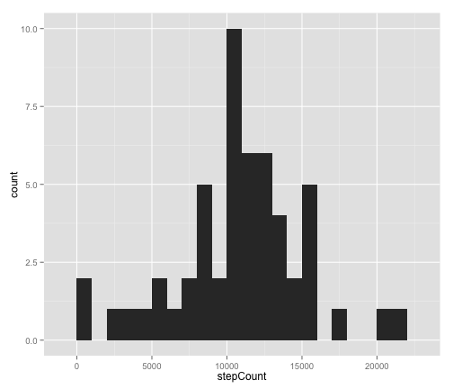
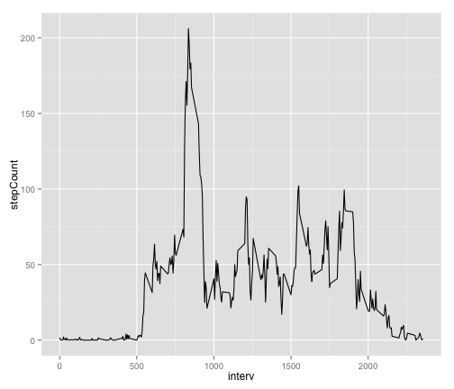
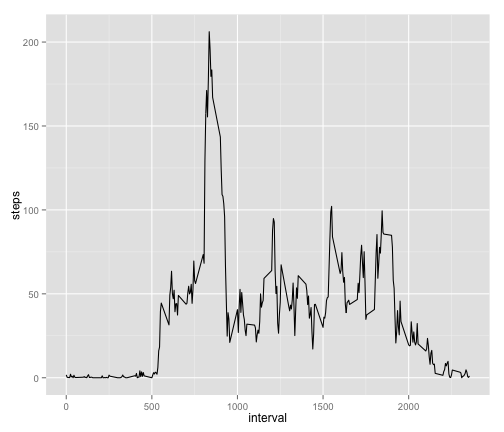
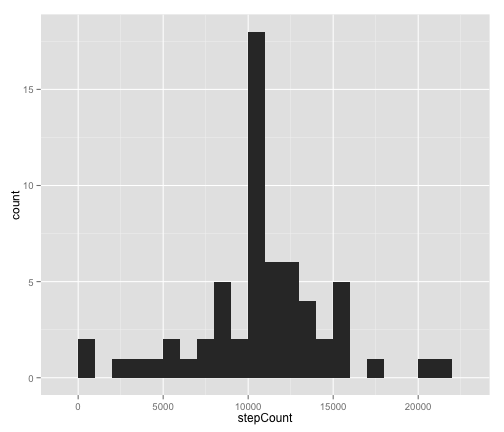
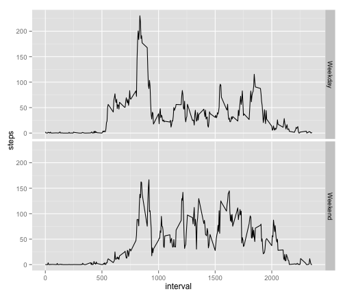

Reproducible Research Peer Assignment 1
========================================================
setwd("/Users/andreahutson/Dropbox/Classes/Reproducible Research/PeerAssessment1")

<body background = "blue">

## Loading and preprocessing the data

*Show any code that is needed to*

**Load the data (i.e. read.csv())**


```r
activity <- read.csv("activity.csv")
str(activity)
```

```
## 'data.frame':	17568 obs. of  3 variables:
##  $ steps   : int  NA NA NA NA NA NA NA NA NA NA ...
##  $ date    : Factor w/ 61 levels "2012-10-01","2012-10-02",..: 1 1 1 1 1 1 1 1 1 1 ...
##  $ interval: int  0 5 10 15 20 25 30 35 40 45 ...
```


**Process/transform the data (if necessary) into a format suitable for your analysis**

There are several steps to process the data to create the graphs required. First, the total number of steps in a day must be caluclated, and then the steps per interval. The code below handles both requirements.


```r
# create a list of all of the days in the data frame
days <- levels(activity$date)

# Calculate total number of steps in a day
calculateDailySteps <- function(activity) {
    dailySteps <- data.frame()
    for (day in days) {
        
        # subset by day
        currentday <- subset(activity, activity$date == day)
        # determine if there are any steps in day
        complete <- sum(complete.cases(currentday))
        # if any steps were taken that day, calculate the sum.
        if (complete != 0) {
            stepCount <- sum(currentday$steps, na.rm = TRUE)
            
        } else {
            # if not, stepcount is 'NA'
            stepCount <- NA
        }
        # bind total number of steps for the day to the day name
        todaySteps <- cbind(day, stepCount)
        todaySteps <- as.data.frame(todaySteps, stringsAsFactors = FALSE)
        # todaySteps$stepCount <- as.numeric(todaySteps$stepCount)
        dailySteps <- rbind(dailySteps, todaySteps)
    }
    
    # change day to date; stepCount to numeric
    dailySteps$day <- as.POSIXlt(dailySteps$day)
    dailySteps$stepCount <- as.numeric(dailySteps$stepCount)
    return(dailySteps)
}


# Calculate steps by time of day

# Create an intervals variable
intervals <- levels(as.factor(activity$interval))

# This function loops through each interval and calculates the mean number
# of steps taken.
calculateIntervalSteps <- function(activity) {
    
    intervalSteps <- data.frame()
    for (interv in intervals) {
        currentInterval <- subset(activity, activity$interval == interv)
        
        # determine if there are any steps in time period
        complete <- sum(complete.cases(currentInterval))
        
        # if any steps were taken in that interval, calculate the mean.
        if (complete != 0) {
            stepCount <- mean(currentInterval$steps, na.rm = TRUE)
            
        } else {
            # if not, stepcount is 'NA'
            stepCount <- NA
        }
        # bind total number of steps for the interval to the interval name
        intervSteps <- cbind(interv, stepCount)
        intervSteps <- as.data.frame(intervSteps, stringsAsFactors = FALSE)
        intervalSteps <- rbind(intervalSteps, intervSteps)
    }
    # change all to numeric
    intervalSteps$interv <- as.numeric(intervalSteps$interv)
    intervalSteps$stepCount <- as.numeric(intervalSteps$stepCount)
    
    return(intervalSteps)
}
dailySteps <- calculateDailySteps(activity)
str(dailySteps)
```

```
## 'data.frame':	61 obs. of  2 variables:
##  $ day      : POSIXlt, format: "2012-10-01" "2012-10-02" ...
##  $ stepCount: num  NA 126 11352 12116 13294 ...
```

```r
intervalSteps <- calculateIntervalSteps(activity)
str(intervalSteps)
```

```
## 'data.frame':	288 obs. of  2 variables:
##  $ interv   : num  0 5 10 15 20 25 30 35 40 45 ...
##  $ stepCount: num  1.717 0.3396 0.1321 0.1509 0.0755 ...
```

```r

```


## What is mean total number of steps taken per day?

*For this part of the assignment, you can ignore the missing values in the dataset.*

**Make a histogram of the total number of steps taken each day**


```r

# Create a histogram
library(ggplot2)
qplot(stepCount, data = dailySteps, binwidth = 1000)
```

 


**Calculate and report the mean and median total number of steps taken per day**


```r
mean(dailySteps$stepCount, na.rm = TRUE)
```

```
## [1] 10766
```

```r
median(dailySteps$stepCount, na.rm = TRUE)
```

```
## [1] 10765
```


## What is the average daily activity pattern?

**Make a time series plot (i.e. type = "l") of the 5-minute interval (x-axis) and the average number of steps taken, averaged across all days (y-axis)**


```r

qplot(interv, stepCount, data = intervalSteps, geom = c("line"))
```

 

```r

# You can also do this without even running the intervalSteps function, with
# a built in function from q plot
qplot(interval, steps, data = activity, geom = "line", stat = "summary", fun.y = "mean")
```

```
## Warning: Removed 2304 rows containing missing values (stat_summary).
```

 


Which 5-minute interval, on average across all the days in the dataset, contains the maximum number of steps?

```r
maxSteps <- max(intervalSteps$stepCount, na.rm = TRUE)
subset(intervalSteps, intervalSteps$stepCount == maxSteps)
```

```
##     interv stepCount
## 104    835     206.2
```

8:35

## Imputing missing values

*Note that there are a number of days/intervals where there are missing values (coded as NA). The presence of missing days may introduce bias into some calculations or summaries of the data.*

**Calculate and report the total number of missing values in the dataset (i.e. the total number of rows with NAs)**


```r
# calculate the sum of the inverse of complete cases of activity (where
# 'complete.cases' is FALSE)
sum(!complete.cases(activity))
```

```
## [1] 2304
```


**Devise a strategy for filling in all of the missing values in the dataset. The strategy does not need to be sophisticated. For example, you could use the mean/median for that day, or the mean for that 5-minute interval, etc.**

My strategy will be to use the mean values for interval to fill in completely empty spots.

**Create a new dataset that is equal to the original dataset but with the missing data filled in.**


```r

newIntervalSteps <- data.frame()
# go through each interval, and replace blanks with NA.
for (interv in intervals) {
    currentInterval <- subset(activity, activity$interval == interv)
    meanSteps <- mean(currentInterval$steps, na.rm = TRUE)
    for (i in 1:61) {
        if (is.na(currentInterval$steps[i])) {
            currentInterval$steps[i] = meanSteps
        }
    }
    # bind data frame
    newIntervalSteps <- rbind(newIntervalSteps, currentInterval)
}
```


Now, let's run our mean script again

```r
# Calculate total number of steps in a day
newDailySteps <- calculateDailySteps(newIntervalSteps)
str(newDailySteps)
```

```
## 'data.frame':	61 obs. of  2 variables:
##  $ day      : POSIXlt, format: "2012-10-01" "2012-10-02" ...
##  $ stepCount: num  10766 126 11352 12116 13294 ...
```

**Make a histogram of the total number of steps taken each day.**


```r

# Create a histogram
library(ggplot2)
qplot(stepCount, data = newDailySteps, binwidth = 1000)
```

 


**Calculate and report the mean and median total number of steps taken per day.**


```r
mean(newDailySteps$stepCount)
```

```
## [1] 10766
```

```r
median(newDailySteps$stepCount)
```

```
## [1] 10766
```


**Do these values differ from the estimates from the first part of the assignment? What is the impact of imputing missing data on the estimates of the total daily number of steps?**

The distribution did change, but the average daily number of steps did not change significantly. 

## Are there differences in activity patterns between weekdays and weekends?

*For this part the weekdays() function may be of some help here. Use the dataset with the filled-in missing values for this part.*


**Create a new factor variable in the dataset with two levels – “weekday” and “weekend” indicating whether a given date is a weekday or weekend day.**

```r
# Find out what day of the week the date was on
dates <- as.POSIXlt(days)  # convert to POSIX
daysofweek <- weekdays(dates)  # find the day of the week

# Label the day of the week as a weekend or a weekday
weekdays <- vector()
for (day in daysofweek) {
    # for each day in the list if the day is Sat or Sun
    if (day == "Saturday" | day == "Sunday") {
        weekday = "Weekend"  # set variable to 'weekend'
    } else {
        # Otherwise,
        weekday = "Weekday"  # set variable to 'weekday'
    }
    weekdays <- rbind(weekdays, weekday)  # bind together
    
}

# Merge with the activity data
daysOfWeek <- as.data.frame(cbind(days, daysofweek, weekdays), stringsAsFactors = FALSE)  # create data frame
colnames(daysOfWeek) <- c("date", "daysofweek", "weekday")  # label columns
all <- merge(newIntervalSteps, daysOfWeek, by = "date")  # merge
```


Bonus code: converting the date and intervals into POSITX time. This would be useful for creating a true time series graph (which is what I originally created, before I realized we needed to submit the mean for each interval for this assignment)

```r
times <- vector()
for (i in all$interval) {
    # for each time in the interval
    
    if (i < 10) {
        # if the time is 0-9, add '000' in front
        time <- paste("000", i, sep = "")
    } else if (i < 100) {
        # if the time is 10-99, add '00' in front
        time <- paste("00", i, sep = "")
    } else if (i < 1000) {
        # if the time is 100-999, add '0' in front
        time <- paste("0", i, sep = "")
    } else {
        # otherwise, the time stays the same, but convert to char
        time <- as.character(i)
    }
    times <- rbind(times, time)  # bind new time to times vector
    
}


# Put a colon in between the times to get them in the format HH:MM
first <- substr(times, 1, 2)  # first part of time
last <- substr(times, 3, 4)  # second part of time
alltime <- paste(first, ":", last, sep = "")  # paste together

# Bind to 'all' data frame
all <- cbind(all, alltime)

# Paste date and time together
all$datetime <- paste(all$date, all$alltime)
# Change to POSIX time
all$datetimePOSIX <- as.POSIXlt(strptime(all$datetime, "%Y-%m-%d %H:%M"))
# Order by time
all <- all[order(all$date, all$interval), ]
```

**Make a panel plot containing a time series plot (i.e. type = "l") of the 5-minute interval (x-axis) and the average number of steps taken, averaged across all weekday days or weekend days (y-axis).**


```r

# plot the mean number of steps at each interval
qplot(interval, steps, data = all, geom = "line", facets = weekday ~ ., stat = "summary", 
    fun.y = "mean")
```

 

